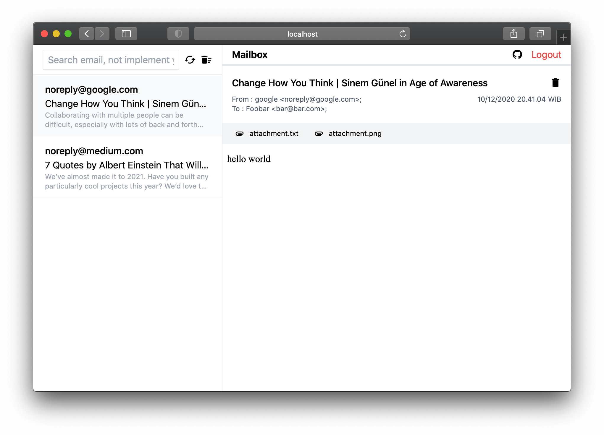

# Mailbox

Inspired by [MailCatcher](http://mailcatcher.me/) and [MailHog](https://github.com/mailhog/MailHog).
Mailbox is free and open source web and api based SMTP testing, that designed to catch
any email you or application is sending and diplay it in web interface instead of
sendirng email to real world.

Built with Go - Mailbox runs without installation on multiple platforms.

## Overview

Mailbox is an email testing tool for developers:

- Configure your application to use Mailbox for SMTP delivery
- View messages in the web UI, or retrieve them with the JSON API
- Optionally release messages to real SMTP servers for delivery



## Installation

The easiest way to run mailbox is using docker, please check the latest version of 
available docker image version [github docker registry](https://github.com/purwandi/mail/packages/533898). 

### Minimal Configuration

## TLS

If you want to use tls connection you can enable tls connection in config env.

```sh
openssl req -x509 -nodes -days 365 -newkey rsa:2048 -keyout cerrtificate.key -out cerrtificate.crt
```


## License

The Mailbox is open-sourced software licensed under the [MIT license](./LICENSE).
